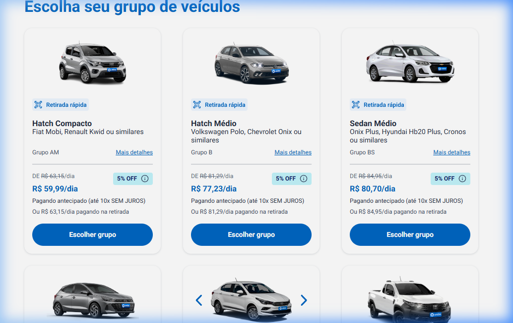
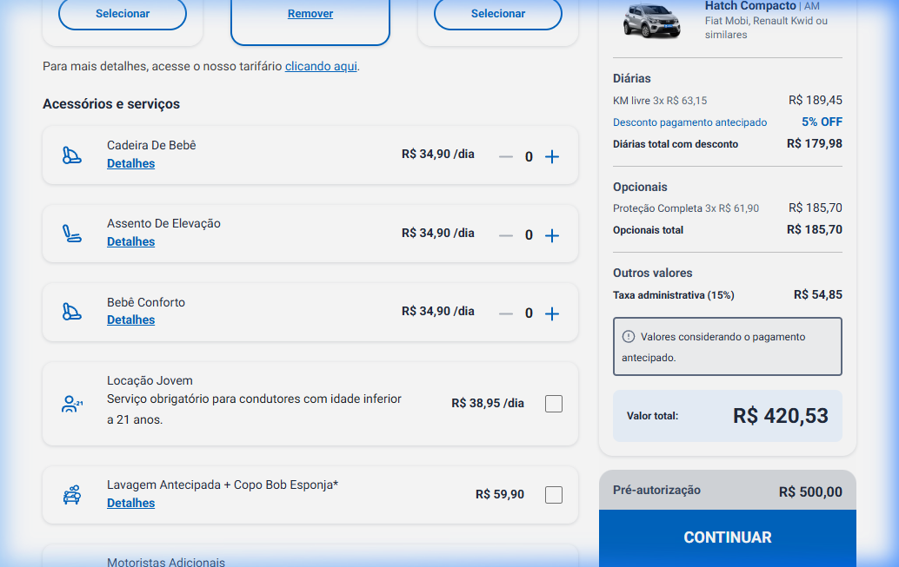

Este repositório contém a suíte de testes E2E (End-to-End) e a documentação técnica da automação realizada no portal Unidas (Projeto InfoTecnologia).

O escopo do projeto vai além da automação de fluxos funcionais, incluindo:
- Testes exploratórios e cenários de borda (bypass de rotas)
- Validação matemática e lógica no front-end (cálculos de opcionais, diárias e taxas)
- Varredura de links quebrados em ambiente de produção
- Documentação e mapeamento de inconsistências estruturais no front-end (Angular Material)

Durante a análise da aplicação foram desenhados e executados 27 cenários de teste. O saldo da automação resultou em:
- 13 Cenários Positivos (Caminho Feliz) validados com sucesso
- 14 Cenários Negativos / Borda testados
- 4 Validações de segurança em navegação (Bypass URL) 100% protegidas pela aplicação
- 1 Defeito (Bug) de UI mapeado na estrutura do Angular Material
- Cobertura de testes E2E estruturada com Cypress + Page Object Model (POM)

### Arquitetura de Automação
A automação foi estruturada utilizando Cypress com padrão Page Object Model (POM), garantindo escalabilidade e manutenção. Os dados e fixtures foram isolados da lógica dos testes.

```
cypress/e2e/
├── pages/
│   ├── HomePage.js
│   ├── VehicleSelectionPage.js
│   └── SummaryPage.js
│
├── specs/
│   ├── 01_fluxo_positivo.cy.js
│   ├── 02_validacao_datas.cy.js
│   ├── 03_bypass_url.cy.js
│   ├── 04_validacao_opcionais.cy.js
│   └── 05_links_quebrados.cy.js
```

### Análise de Segurança & Regras de Negócio

**CT-003 — Bypass de URL (Segurança de Rotas)**
- **Objetivo:** Tentar acessar rotas dos Passos 2, 3 e 4 do fluxo de reserva diretamente pela URL, sem possuir uma sessão ou preencher os dados anteriores.
- **Resultado:** A aplicação trata o fluxo de forma segura. Nenhuma falha de exposição foi encontrada. O sistema aplica o "fallback" corretamente, redirecionando para páginas seguras.

**CT-005 — Injeção JS e Botões Negativos**
- **Objetivo:** Forçar a adição de valores negativos nos acessórios via painel e injeção de eventos JS (`dispatchEvent`).
- **Resultado:** A aplicação possui regras sólidas no DOM e não vai abaixo de `0`. O valor total da locação permanece positivo e a lógica matemática de `Diárias + Opcionais + 15% Taxa` não é corrompida.

### Code Review — Defeitos Encontrados (Frontend / UI)

**DEF-001 — Botão '+' nos opcionais com quantidade (Medium)**
- **Problema:** O seletor do botão '+' nos opcionais (Cadeira de Bebê, Bebê Conforto) não localiza o elemento Angular Material de forma acessível. 
- **Causa Raiz:** O Angular renderiza o ícone como `<mat-icon>add</mat-icon>` dentro de um botão genérico sem atributo `aria-label` ou `id` claro para automação ou acessibilidade. A busca depende da estrutura exata do nó da árvore.

---

### Casos de Teste Mapeados e Executados

Abaixo listamos todos os cenários E2E cobertos neste projeto, separados por suas respectivas suítes:

#### 🟢 Fluxo Positivo — Caminho Feliz (01_fluxo_positivo.cy.js)
1. **CT-001.1** — Formulário de busca carregado
2. **CT-001.2** — Autocomplete de lojas ao digitar cidade
3. **CT-001.3** — Loja Aeroporto de Confins selecionada
4. **CT-001.4** — Calendário de retirada exibido
5. **CT-001.5** — Navegação para Passo 2 com listagem de veículos
6. **CT-001.6** — Navegação para Passo 3 com resumo da reserva
7. **CT-001.7** — Seção "Acessórios e Serviços" exibida
8. **CT-001.8** — Cadeira de Bebê (valor recalculado)
9. **CT-001.9** — Assento de Elevação (valor recalculado)
10. **CT-001.10** — Bebê Conforto (valor recalculado)
11. **CT-001.11** — Locação Jovem (checkbox validado)
12. **CT-001.12** — Lavagem Antecipada (checkbox validado)
13. **CT-001.13** — Avanço para o Passo 4 (Resumo Final) com sucesso

#### 🔴 Fluxo Negativo e Regras de Negócio (02, 04, 05_validacao.cy.js)
14. **CT-002.1** — Data de devolução anterior à retirada (bloqueado sem request ao backend)
15. **CT-002.2** — Botão "Continuar" não avança com formulário incompleto
16. **CT-004.2** — Incrementar botões `+` sem falha
17. **CT-005.1** — Botão `−` (decremento) nunca fica menor que zero
18. **CT-005.2** — Injeção JS de valores negativos não corrompe o cálculo
19. **CT-005.3** — Validação matemática exata: `(Diárias + Opcionais) + 15% Taxa = Total`
20. **CT-005.4** — Crescimento progressivo correto ao adicionar opcionais
21. **CT-005.5** — Redução perfeita do valor total ao remover itens do carrinho

#### 🛡️ Fluxo de Segurança de Rotas — Bypass URL (03_bypass_url.cy.js)
22. **CT-003.1** — Tentativa de acesso direto ao `/passo-2` sem sessão ativa
23. **CT-003.2** — Tentativa de acesso direto ao `/passo-3` sem veículo escolhido
24. **CT-003.3** — Tentativa de acesso direto ao `/passo-4`
25. **CT-003.4** — URL estática completamente inexistente (página 404 correta)

#### 🔗 Qualidade de Navegação (05_links_quebrados.cy.js)
26. **CT-006.1** — Varredura massiva na página inicial (20 links internos respondendo `< 400`)
27. **CT-006.2** — Link do tarifário oficial está funcional na página

---

### Evidências da Execução (Cypress)

Para comprovar a estabilidade do fluxo de automação e as validações, acompanhe abaixo as capturas geradas durante os passos da reserva:

**1. Formulário Preenchido (Local e Data)**  
*(Evidenciando o preenchimento inicial dos cenários CT-001.1 ao CT-001.4)*  


**2. Passo 2 — Seleção de Veículos**  
*(Evidenciando o CT-001.5: listagem e filtros de carro)*  


**3. Passo 3 — Resumo e Opcionais (Validação Matemática)**  
*(Evidenciando os CT-005: adição de cadeira de bebê, lavagem antecipada e recálculo da taxa)*  


---

### Considerações finais
Neste projeto, atuei como QA com uma abordagem moderna e ofensiva de qualidade, indo além da automação tradicional de testes.

Minha análise incluiu:
- automação de testes E2E com Cypress (Page Object Model)
- análise de segurança estrutural com testes de bypass de URLs
- investigação de comportamento da aplicação em runtime (foco em injeção JavaScript e limites no carrinho)
- mapeamento de falhas de acessibilidade e seletores (Angular Material)
- validação matemática complexa em formulários dinâmicos

O objetivo não foi apenas validar funcionalidades (o chamado "Happy Path"), mas sim simular uma análise real de qualidade em ambiente de produção, identificando riscos na arquitetura front-end e atestando a integridade das regras de negócio.

### Encerramento
Obrigado pela oportunidade de participar do desafio técnico. Fico à disposição para os próximos passos.
