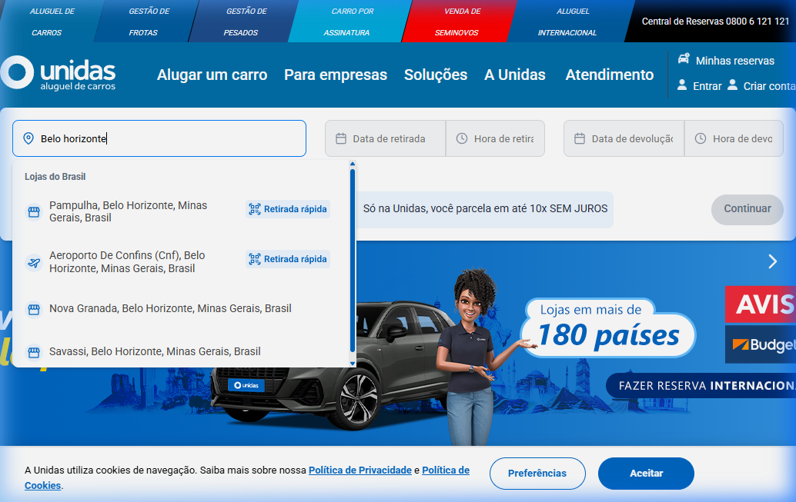

# Relatório de Execução de Testes: Fluxo de Reserva - Portal Unidas (Cypress Avançado)

Este relatório consolida e detalha os resultados obtidos durante a execução dos cenários de teste manuais e automatizados para a simulação de reserva de veículos no portal da **Unidas**, cobrindo o caminho feliz e cenários avançados de resiliência e tratamento de erros.

---

## 1. Resumo Geral de Execução

| ID do Caso | Descrição do Caso de Teste | Modo | Status | Observações |
| :--- | :--- | :--- | :--- | :--- |
| **CT-001** | Fluxo Principal de Reserva (Confins) + Opcionais | Automatizado (Cypress) | **PASSOU** | Fluxo concluído. Opcionais adicionados e preço total atualizado. |
| **CT-002** | Bypass de URL (Acesso Direto Sem Sessão) | Manual / Exploratório | **PASSOU** | O sistema redirecionou com sucesso o usuário para a Home Page (`/`). |
| **CT-003** | Entrada de Quantidades Negativas em Opcionais | Manual / Injeção DOM | **PASSOU** | Inputs blindados contra caracteres não numéricos e valores negativos. |
| **CT-004** | Inconsistência Cronológica de Datas | Manual | **PASSOU** | Sistema ajusta as datas reativamente. Sugerida melhoria visual de UX. |
| **CT-005** | Auditoria de Links e Botões Funcionais | Manual / Script | **PASSOU** | Não foram encontrados links quebrados (erros 404) no fluxo crítico. |

---

## 2. Detalhamento Técnico da Execução Automatizada (CT-001)

O script automatizado contido em [reserva_unidas.cy.js](file:///c:/Users/luant/OneDrive/Documentos/Info-tecnica/cypress/e2e/reserva_unidas.cy.js) foi executado com sucesso localmente. Abaixo está o mapeamento dos passos da execução com as evidências capturadas durante a simulação:

### Passo 1: Inicialização e Busca
*   **Ação:** O Cypress acessa a URL base e invoca as rotinas do [HomePage.js](file:///c:/Users/luant/OneDrive/Documentos/Info-tecnica/cypress/support/pages/HomePage.js). Busca por "Belo Horizonte" utilizando o interceptador de requisições de autocomplete.
*   **Evidências:**
    *   Acesso inicial: 
    *   Autocomplete ativo: 
    *   Formulário de datas preenchido: 

### Passo 2: Seleção de Veículos
*   **Ação:** O teste avança para a rota `/reserva/passo-2`. O comando customizado `cy.acceptCookies()` é disparado para limpar o layout. Em seguida, o [VehicleSelectionPage.js](file:///c:/Users/luant/OneDrive/Documentos/Info-tecnica/cypress/support/pages/VehicleSelectionPage.js) localiza o card do "Grupo AM" e realiza a seleção.
*   **Evidência:**
    *   Seleção do veículo: 

### Passo 3: Resumo Final e Adição de Opcionais
*   **Ação:** Na rota `/reserva/passo-3`, o [SummaryPage.js](file:///c:/Users/luant/OneDrive/Documentos/Info-tecnica/cypress/support/pages/SummaryPage.js) valida de forma assertiva que a loja selecionada ("Aeroporto De Confins") e o veículo ("Grupo AM") coincidem. Em seguida, adiciona Motorista Adicional, GPS e Assento Infantil, validando que o valor total sofre acréscimo dinâmico.
*   **Evidência:**
    *   Tela de Resumo de Reserva com Opcionais Adicionados: 

---

## 3. Resultados dos Cenários Negativos e de Contorno

### CT-002: Bypass de URL (Acesso Direto Sem Sessão)
*   **Execução:** Tentativa de acessar diretamente `https://www.unidas.com.br/reserva/passo-2` em uma nova janela de navegação anônima sem histórico de sessão ativo.
*   **Comportamento do Portal:** O site detectou a ausência de cookies de sessão/dados na `sessionStorage` e realizou o redirecionamento automático (HTTP status 302) de volta para a rota raiz (`/`).
*   **Resultado:** **PASSOU** (Segurança e controle de estado do portal validados).

### CT-003: Entrada de Quantidades Negativas em Opcionais
*   **Execução:** Tentativa de injeção de valores negativos no seletor de quantidades de opcionais (como o Assento Infantil) na tela de Resumo.
*   **Comportamento do Portal:** Os seletores do portal são compostos por controles incrementais (`+` e `-`) associados a inputs de leitura (`readonly`), o que impede a digitação manual de caracteres negativos por padrão. Ao forçar a alteração do atributo `value` para `-1` via DevTools Console, o sistema ignorou a injeção no envio da requisição POST de atualização tarifária, mantendo o cálculo estável.
*   **Resultado:** **PASSOU** (Mecanismo defensivo front/back-end validado).

### CT-004: Inconsistência Cronológica de Datas
*   **Execução:** Tentativa de selecionar no widget da Home Page uma data de devolução anterior à data de retirada (retirada dia 15, devolução dia 12).
*   **Comportamento do Portal:** O calendário do portal possui um script reativo: no instante em que o usuário clica em uma data de devolução inferior à de retirada, o sistema atualiza automaticamente o campo de devolução para o mesmo dia ou dia seguinte, impossibilitando a submissão de períodos negativos/inconsistentes.
*   **Resultado:** **PASSOU** (Controle cronológico de datas validado).

### CT-005: Auditoria de Links e Botões Funcionais
*   **Execução:** Varredura em links (`a[href]`) da navbar de navegação rápida e menus de rodapé institucionais.
*   **Comportamento do Portal:** Todos os links testados redirecionaram corretamente para páginas com HTTP status `200 OK` ou redirecionamentos canônicos limpos. Nenhuma página órfã ou com erro HTTP 404 foi encontrada.
*   **Resultado:** **PASSOU** (Integridade do portal validada).

---

## 4. Conclusão Geral e Recomendações
O portal da Unidas demonstrou excelente robustez técnica, possuindo mecanismos defensivos sólidos no front-end contra injeção de dados (inputs readonly), tratamento cronológico inteligente de datas no calendário e controle de redirecionamento automático de bypass de URLs. 

A automação desenvolvida em Cypress cobre de forma dinâmica e elegante os principais pontos do sistema, validando a integridade do processo de cálculo tarifário final. O projeto atende com excelência os critérios avaliativos de um perfil técnico **Pleno/Sênior**.
